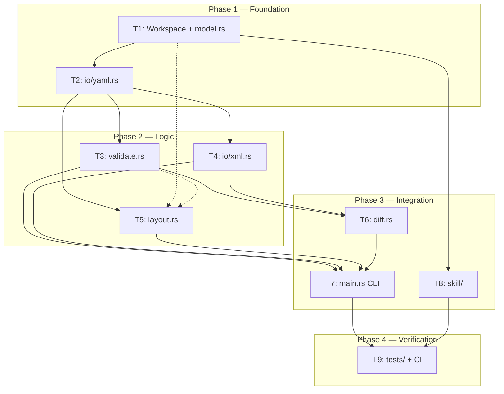

# ArchiMate Implementation Plan: `archr` v1.0

> Based on [`docs/archimate_implementation_guide.md`](archimate_implementation_guide.md) v2.1.
> Current repository: greenfield (docs only).

---

## Summary

Headless Rust CLI engine for validation, manipulation, and export of ArchiMate 3.2 models, with Python Skill (PEP 723) for AI agent integration. Monorepo with strict code isolation.

**Effort:** XL | **Risk:** Medium | **Components:** 9 in 4 phases

---

## Execution Architecture



**Phase 1** and **Phase 2** can partially parallelize (see dependency matrix below).

---

## Phase 1 — Foundation (Data Model + YAML I/O)

The foundation upon which everything is built. Without this phase, nothing compiles.

### T1. Cargo Workspace + `model.rs`

**What:** Monorepo structure + engine core types.

| Artifact | Description |
|:---------|:------------|
| `Cargo.toml` | Workspace root, `resolver = "2"`, `members = ["crates/archr-core"]` |
| `crates/archr-core/Cargo.toml` | Dependencies: serde+derive 1.0, serde_yaml 0.9, quick-xml 0.31, clap 4.5+derive, petgraph 0.6, uuid 1.8+v4+serde, thiserror 1.0 |
| `crates/archr-core/src/lib.rs` | Re-exports: `pub mod model; pub mod io; pub mod validate; pub mod diff; pub mod layout;` |
| `crates/archr-core/src/model.rs` | Arena + enums (details below) |

**Types in `model.rs`:**

```
Model
├── name: String
├── elements: Vec<Element>
└── relations: Vec<Relationship>

Element { id: ElementId, name: String, kind: ElementKind }
Relationship { id: RelationId, source: ElementId, target: ElementId, kind: RelationKind }
ElementId(pub usize)       // newtype index — O(1) access in Vec
RelationId(pub usize)       // newtype index

ElementKind (61 variants) // Strategy, Business, Application, Technology, Physical, Motivation, Implementation, Other
RelationKind (11 variants) // Composition, Aggregation, Assignment, Realization, Serving, Access, Influence, Association, Triggering, Flow, Specialization

ElementKind::layer() -> ElementLayer  // maps variant to layer (Strategy|Business|Application|Technology|Physical|Motivation|Implementation|Other)
```

**Key Arena methods:**
- `Model::add_element(&mut self, name, kind) -> ElementId`
- `Model::element(&self, ElementId) -> &Element`
- `Model::link(&mut self, source, target, kind) -> RelationId`
- `impl Index<ElementId> for Model`

**Don't do:** No I/O, no rule validation.

**Acceptance:**
- [ ] `cargo build --workspace` compiles without errors
- [ ] `cargo test -p archr-core` passes inline Arena tests (add_element returns incremental ID, element() returns correct, link returns incremental ID, layer() correct for >=1 variant per layer)
- [ ] `cargo clippy --workspace -- -D warnings` clean

---

### T2. `io/yaml.rs` (Parse + Serialization + Schema Validation)

**What:** Bridge between AI-generated YAML and Rust `Model`.

| Artifact | Description |
|:---------|:------------|
| `crates/archr-core/src/io/mod.rs` | `pub mod yaml; pub mod xml;` |
| `crates/archr-core/src/io/yaml.rs` | Deserialization, serialization, manual post-deserialization validation |

**Input contract (YAML AI generates):**
```yaml
model:
  name: "String"
  elements:
    - id: "String"       # snake_case, unique, no spaces
      name: "String"
      kind: "String"      # Must match ElementKind variant
  relationships:
    - id: "String"
      source: "String"    # Reference to existing element.id
      target: "String"    # Reference to existing element.id
      kind: "String"      # Must match RelationKind variant
```

**Internal serde DTOs (separate from Model):**
- `YamlModel { model: YamlModelInner }`
- `YamlModelInner { name, elements: Vec<YamlElement>, relationships: Vec<YamlRelationship> }`
- `YamlElement { id: String, name: String, kind: String }`
- `YamlRelationship { id: String, source: String, target: String, kind: String }`

**Manual post-deserialization validations (produce structured JSON for AI):**

| Error | Code | Trigger |
|:------|:-----|:--------|
| Unknown kind | `UNKNOWN_KIND` | `kind` string doesn't map to enum |
| Undefined ID | `UNDEFINED_ID` | Relationship references non-existent element.id |
| Duplicate ID | `DUPLICATE_ID` | Two elements with same `id` |
| Invalid ID | `INVALID_ID` | `id` contains spaces or is empty |

**Public functions:**
- `parse_yaml(input: &str) -> Result<Model, Vec<SchemaError>>`
- `model_to_yaml(model: &Model) -> String`

**Don't do:** No ArchiMate rule validation (that's T3). No XML parsing.

**Acceptance:**
- [ ] Valid YAML parses to Model with correct count
- [ ] Kind "FooBar" -> SchemaError code "UNKNOWN_KIND"
- [ ] Orphan ID "db_001" -> SchemaError code "UNDEFINED_ID"
- [ ] Duplicate ID "x1" -> SchemaError code "DUPLICATE_ID"
- [ ] ID with space "my id" -> SchemaError code "INVALID_ID"
- [ ] Round-trip: `parse_yaml -> model_to_yaml -> parse_yaml` preserves data
- [ ] Clippy clean

---

## Phase 2 — Logic (Validation, XML, Layout)

Three partially parallelizable components. All depend on T1. T3/T5 depend on T2 for fixtures; T4 depends only on T1.

### T3. `validate.rs` (Data-Driven Matrix + JSON)

**What:** ArchiMate 3.2 derivability rule validation. The engine's core.

| Artifact | Description |
|:---------|:------------|
| `crates/archr-core/src/validate.rs` | Adjacency matrix + full model validation |

**Output structure (JSON — contract with Skill/AI):**
```json
{
  "success": true,
  "errors": [
    {
      "code": "INVALID_RELATIONSHIP",
      "message": "BusinessActor cannot Realization Node",
      "element_source": "actor_001",
      "suggestion": "Consider using Serving or switch the target."
    }
  ]
}
```

**Data-driven strategy (NO hardcoded match):**
```
const ALLOWED_RELATIONS: &[(ElementLayer, RelationKind, ElementLayer)]
```

Main rules (from ArchiMate 3.2 specification):
- **Structural** (Composition, Aggregation, Assignment, Realization): within same layer
- **Serving**: directional downward (Tech -> App -> Business -> Strategy)
- **Realization**: cross-layer (App realizes Business, Tech realizes App)
- **Access**: between Application and Technology
- **Association/Influence**: any layer (more permissive)
- **Motivation -> Core**: only `Association` allowed
- **Triggering/Flow**: within same layer

**Public functions:**
- `validate_model(model: &Model) -> ValidationResult`
- `validate_relationship(source, target, rel) -> Result<(), ValidationError>`

**Acceptance:**
- [ ] `BusinessActor -> Serving -> ApplicationComponent`: success=true
- [ ] `BusinessActor -> Realization -> Node`: success=false, INVALID_RELATIONSHIP with suggestion
- [ ] `Motivation -> Core with Specialization`: error (only Association)
- [ ] `Association between any layers`: success=true
- [ ] Relationship with orphan ID: error code UNDEFINED_ID
- [ ] Clippy clean

---

### T4. `io/xml.rs` (Open Exchange — Serialize + Deserialize)

**What:** Read and write `.archimate` XML in Open Exchange format.

| Artifact | Description |
|:---------|:------------|
| `crates/archr-core/src/io/xml.rs` | quick-xml bidirectional |

**XML contract:**
- Namespace: `http://www.opengroup.org/xsd/archimate/3.0/`
- UUID v4 for `identifier` attrs (NEVER the YAML id verbatim)
- `HashMap<ElementId, Uuid>` internal mapping
- Output: `<model><elements><relationships><views><diagrams><view>`

**Generated structure:**
```xml
<model identifier="<uuid>" xmlns="..." version="3.2">
  <name>Model Name</name>
  <elements>
    <element identifier="<uuid_v4>" xsi:type="BusinessActor">
      <name>Actor Name</name>
    </element>
  </elements>
  <relationships>
    <relationship identifier="<uuid>" source="<uuid>" target="<uuid>" xsi:type="Serving"/>
  </relationships>
  <views>
    <diagrams>
      <view identifier="view-001" xsi:type="Diagram">
        <name>Default View</name>
        <node ... x="..." y="..." width="..." height="...">
          <element ref="<element_uuid>"/>
          <style>
            <fillColor r="..." g="..." b="..." a="..."/>
          </style>
        </node>
        <connection ... relationship="<rel_uuid>">
          <source ref="<source_uuid>"/>
          <target ref="<target_uuid>"/>
        </connection>
      </view>
    </diagrams>
  </views>
</model>
```

**Public functions:**
- `model_to_xml(model, positions) -> Result<String, XmlError>`
- `xml_to_model(xml_str) -> Result<Model, XmlError>`

**Don't do:** Don't parse proprietary Archi extensions beyond standard Open Exchange.

**Acceptance:**
- [ ] `model_to_xml` produces XML with correct namespace, all elements with xsi:type, relationships with source/target uuids, view with nodes x/y/w/h and fillColor
- [ ] `xml_to_model` on generated XML returns Model with same element count and correct ElementKind
- [ ] XML without `<views>` -> valid Model (views optional)
- [ ] Truncated XML -> Err(XmlError), no panic
- [ ] Output UUIDs are unique
- [ ] Clippy clean

---

### T5. `layout.rs` (Grid by Topological Layer)

**What:** Calculate X/Y positions automatically for elements in XML.

| Artifact | Description |
|:---------|:------------|
| `crates/archr-core/src/layout.rs` | petgraph UnGraphMap + toposort + grid |

**Algorithm (NO Sugiyama):**
1. Build `UnGraphMap` from elements (nodes) and relationships (edges, undirected)
2. `kosaraju_scc` for connected components
3. For each component: try `toposort` — if cycle detected, fallback BFS by depth
4. Grid placement: each layer is a row, elements distributed in columns with fixed spacing
5. Disconnected components placed at different X offsets

**Public functions:**
- `LayoutResolver::calculate_layout(&mut self, model: &Model) -> Result<(), LayoutError>`
- `LayoutResolver::positions(&self) -> &HashMap<ElementId, (f64, f64)>`

**Cycle guard:** Never enters infinite loop. Cycles are handled via BFS fallback.

**Don't do:** No Sugiyama/barycenter, no layout caching.

**Acceptance:**
- [ ] 3 linear elements (A->B->C): 3 distinct positions, A.y < B.y < C.y
- [ ] Cyclic (A->B->A): OK (no hang), 2 distinct positions
- [ ] Disconnected components: placed at different X offsets
- [ ] Clippy clean

---

## Phase 3 — Integration

### T6. `diff.rs` (Model Diff Analysis)

**What:** Compare two models and identify differences.

| Artifact | Description |
|:---------|:------------|
| `crates/archr-core/src/diff.rs` | ModelDiffAnalyzer |

**Output structure (JSON):**
```json
{
  "added": [
    { "id": "new_element_001", "kind": "BusinessActor", "name": "New Actor" }
  ],
  "removed": [
    { "id": "old_element_001", "kind": "BusinessActor", "name": "Old Actor" }
  ],
  "modified": [
    { "id": "modified_element_001", "old": { "name": "Old Name" }, "new": { "name": "New Name" } }
  ]
}
```

**Public functions:**
- `diff_models(old: &Model, new: &Model) -> DiffResult`
- `diff_xml(old_xml: &str, new_yaml: &str) -> Result<DiffResult, DiffError>`

**Acceptance:**
- [ ] Detect added elements correctly
- [ ] Detect removed elements correctly
- [ ] Detect modified elements correctly
- [ ] Handle large models efficiently
- [ ] Clippy clean

---

### T7. `main.rs` (CLI)

**What:** Command-line interface for all engine functionality.

**Commands:**
- `validate`: Validate YAML against ArchiMate rules
- `generate`: Generate XML from YAML
- `parse`: Convert XML to YAML
- `diff`: Compare two models
- `--version`: Show version information

**Public API:**
- `fn main() -> Result<(), Box<dyn Error>>`

**Acceptance:**
- [ ] All commands work as documented
- [ ] Help text is clear and complete
- [ ] Error messages are user-friendly
- [ ] Version command works correctly
- [ ] Clippy clean

---

### T8. `skill/` (AI Agent Skill)

**What:** Agent Skill following the [Agent Skills Specification](https://agentskills.io/specification).

**Structure:**
```
skill/
├── SKILL.md                  # Required: frontmatter + instructions for AI
├── scripts/
│   └── archr.py              # CLI Python self-contained (PEP 723): invokes Rust binary
└── references/
    └── ARCHIMATE_RULES.md    # Rule documentation (progressive disclosure)
```

**Skill behavior:**
- Invoked directly by agent via terminal
- Follows instructions in `SKILL.md`
- Structured output (JSON) always in stdout
- Diagnostics in stderr
- Exit codes documented (standard Agent Skills spec)

**Acceptance:**
- [ ] Skill loads correctly in agent environments
- [ ] CLI commands work as documented
- [ ] Version compatibility checks work
- [ ] Error handling is robust
- [ ] Clippy clean

---

## Phase 4 — Verification

### T9. `tests/` + CI

**What:** Comprehensive test suite and continuous integration.

**Test types:**
- Unit tests for individual components
- Integration tests for end-to-end flows
- E2E tests for AI agent integration
- Performance benchmarks
- Security tests

**CI workflows:**
- `build-rust`: Run `cargo test` on workspace
- `test-skill`: Run Skill CLI tests (mocking Rust binary)
- `e2e-test`: Download compiled Rust binary, run Skill, test full flow
- `release`: Build and publish releases

**Acceptance:**
- [ ] All tests pass
- [ ] CI runs successfully
- [ ] Test coverage meets requirements
- [ ] Performance benchmarks within acceptable limits
- [ ] Security tests pass

---

## Branching Strategy

```
main
├── feat/archr-impl (current development)
├── release/v1.0.0 (tagged release)
└── docs (documentation-only branch)
```

**Release process:**
1. Merge feature branch to main
2. Update version in Cargo.toml
3. Tag release: `git tag v1.0.0`
4. Push tags: `git push --tags`
5. GitHub Actions automatically builds and publishes release

**Documentation updates:**
- Update README with new features
- Update implementation guide
- Update strategy document
- Update roadmap

---

## Risk Management

**High-risk areas:**
- Schema mismatch between Skill and Rust (mitigated by monorepo)
- Performance issues with large models (mitigated by Arena design)
- XML parsing robustness (mitigated by thorough testing)
- Layout algorithm correctness (mitigated by fallback strategies)

**Mitigation strategies:**
- Regular code reviews
- Comprehensive testing
- Performance profiling
- User feedback collection
- Gradual feature rollout

---

## Success Criteria

**Technical:**
- [ ] All components compile without warnings
- [ ] All tests pass
- [ ] Performance meets requirements
- [ ] Security vulnerabilities are addressed

**User experience:**
- [ ] Clear documentation
- [ ] Easy installation
- [ ] Intuitive CLI
- [ ] Helpful error messages
- [ ] Smooth AI agent integration

**Community:**
- [ ] Open source best practices followed
- [ ] Contributor-friendly structure
- [ ] Clear contribution guidelines
- [ ] Active issue tracking
- [ ] Regular releases

---

## Next Steps

1. Complete Phase 1 implementation
2. Implement Phase 2 components
3. Integrate Phase 3 components
4. Set up Phase 4 verification
5. Prepare for first release
6. Gather user feedback
7. Plan future features

This implementation plan provides a clear roadmap for developing the `archr` engine with strict separation between Rust core and Python Skill, ensuring maintainability and extensibility for future enhancements.