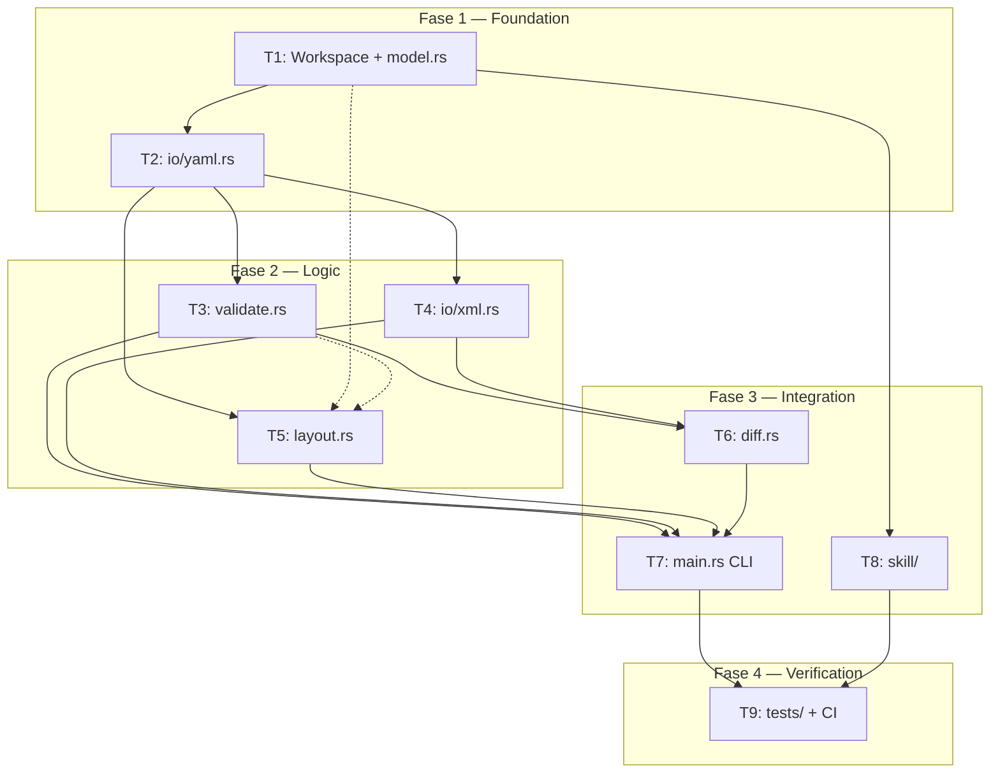

# Plano de Implementacao: `archr` v1.0

> Baseado em [`docs/guia_implementacao.md`](guia_implementacao.md) v2.1.
> Repositorio atual: greenfield (apenas docs/).

---

## Resumo

Motor headless Rust CLI para validacao, manipulacao e exportacao de modelos ArchiMate 3.2, com Skill Python (PEP 723) para integracao com agentes de IA. Monorepo com isolamento estrito de codigo.

**Esforco:** XL | **Risco:** Medio | **Componentes:** 9 em 4 fases

---

## Arquitetura de Execucao



**Fase 1** e **Fase 2** internas podem paralelizar parcialmente (ver matriz de dependencias abaixo).

---

## Fase 1 — Foundation (Modelo de Dados + I/O YAML)

Base sobre a qual tudo se constroi. Sem esta fase, nada compila.

### T1. Cargo Workspace + `model.rs`

**O que:** Estrutura do monorepo + tipos centrais do motor.

| Artefato | Descricao |
|:---------|:----------|
| `Cargo.toml` | Workspace root, `resolver = "2"`, `members = ["crates/archr-core"]` |
| `crates/archr-core/Cargo.toml` | Deps: serde+derive 1.0, serde_yaml 0.9, quick-xml 0.31, clap 4.5+derive, petgraph 0.6, uuid 1.8+v4+serde, thiserror 1.0 |
| `crates/archr-core/src/lib.rs` | Re-exports: `pub mod model; pub mod io; pub mod validate; pub mod diff; pub mod layout;` |
| `crates/archr-core/src/model.rs` | Arena + enums (ver detalhes abaixo) |

**Tipos em `model.rs`:**

```
Model
├── name: String
├── elements: Vec<Element>
└── relations: Vec<Relationship>

Element { id: ElementId, name: String, kind: ElementKind }
Relationship { id: RelationId, source: ElementId, target: ElementId, kind: RelationKind }
ElementId(pub usize)       // newtype index — acesso O(1) em Vec
RelationId(pub usize)       // newtype index

ElementKind (61 variantes) // Strategy, Business, Application, Technology, Physical, Motivation, Implementation, Other
RelationKind (11 variantes) // Composition, Aggregation, Assignment, Realization, Serving, Access, Influence, Association, Triggering, Flow, Specialization

ElementKind::layer() -> ElementLayer  // mapeia variante para camada (Strategy|Business|Application|Technology|Physical|Motivation|Implementation|Other)
```

**Metodos-chave do Arena:**
- `Model::add_element(&mut self, name, kind) -> ElementId`
- `Model::element(&self, ElementId) -> &Element`
- `Model::link(&mut self, source, target, kind) -> RelationId`
- `impl Index<ElementId> for Model`

**Nao fazer:** Nenhum I/O, nenhuma validacao de regras.

**Aceitacao:**
- [ ] `cargo build --workspace` compila sem erros
- [ ] `cargo test -p archr-core` passa testes inline do Arena (add_element retorna ID incremental, element() retorna correto, link retorna ID incremental, layer() correto para >=1 variante por camada)
- [ ] `cargo clippy --workspace -- -D warnings` limpo

---

### T2. `io/yaml.rs` (Parse + Serializacao + Validacao de Schema)

**O que:** Ponte entre o YAML gerado pela IA e o `Model` Rust.

| Artefato | Descricao |
|:---------|:----------|
| `crates/archr-core/src/io/mod.rs` | `pub mod yaml; pub mod xml;` |
| `crates/archr-core/src/io/yaml.rs` | Deserializacao, serializacao, validacao manual pos-deserializacao |

**Contrato de entrada (YAML que a IA gera):**
```yaml
model:
  name: "String"
  elements:
    - id: "String"       # snake_case, unico, sem espacos
      name: "String"
      kind: "String"      # Deve bater com variante ElementKind
  relationships:
    - id: "String"
      source: "String"    # Ref a element.id existente
      target: "String"    # Ref a element.id existente
      kind: "String"      # Deve bater com variante RelationKind
```

**DTOs serde (interno, separado de Model):**
- `YamlModel { model: YamlModelInner }`
- `YamlModelInner { name, elements: Vec<YamlElement>, relationships: Vec<YamlRelationship> }`
- `YamlElement { id: String, name: String, kind: String }`
- `YamlRelationship { id: String, source: String, target: String, kind: String }`

**Validacoes manuais pos-deserializacao (produzem JSON estruturado para a IA):**

| Erro | Code | Trigger |
|:-----|:-----|:--------|
| Kind desconhecido | `UNKNOWN_KIND` | `kind` string nao mapeia a enum |
| ID nao definido | `UNDEFINED_ID` | Relacao referencia element.id inexistente |
| ID duplicado | `DUPLICATE_ID` | Dois elements com mesmo `id` |
| ID invalido | `INVALID_ID` | `id` contem espacos ou vazio |

**Funcoes publicas:**
- `parse_yaml(input: &str) -> Result<Model, Vec<SchemaError>>`
- `model_to_yaml(model: &Model) -> String`

**Nao fazer:** Nenhuma validacao de regras ArchiMate (isso e T3). Nenhum parsing de XML.

**Aceitacao:**
- [ ] YAML valido parseia para Model com contagem correta
- [ ] Kind "FooBar" -> SchemaError code "UNKNOWN_KIND"
- [ ] ID orfao "db_001" -> SchemaError code "UNDEFINED_ID"
- [ ] ID duplicado "x1" -> SchemaError code "DUPLICATE_ID"
- [ ] ID com espaco "my id" -> SchemaError code "INVALID_ID"
- [ ] Round-trip: `parse_yaml -> model_to_yaml -> parse_yaml` preserva dados
- [ ] Clippy limpo

---

## Fase 2 — Logic (Validacao, XML, Layout)

Tres componentes parcialmente paralelizaveis. Todos dependem de T1. T3/T5 dependem de T2 para fixtures; T4 depende so de T1.

### T3. `validate.rs` (Matriz Data-Driven + JSON)

**O que:** Validacao de regras de derivabilidade ArchiMate 3.2. O coracao do motor.

| Artefato | Descricao |
|:---------|:----------|
| `crates/archr-core/src/validate.rs` | Matriz de adjacencia + validacao de modelo completo |

**Estrutura de saida (JSON — contrato com a Skill/IA):**
```json
{
  "success": true,
  "errors": [
    {
      "code": "INVALID_RELATIONSHIP",
      "message": "BusinessActor nao pode Realization Node",
      "element_source": "actor_001",
      "suggestion": "Considere usar Serving ou troque o alvo."
    }
  ]
}
```

**Estrategia data-driven (NENHUM match hardcoded):**
```
const ALLOWED_RELATIONS: &[(ElementLayer, RelationKind, ElementLayer)]
```

Regras principais (da especificacao ArchiMate 3.2):
- **Estruturais** (Composition, Aggregation, Assignment, Realization): dentro da mesma camada
- **Serving**: direcional descendente (Tech -> App -> Business -> Strategy)
- **Realization**: cruzamento de camada (App realiza Business, Tech realiza App)
- **Access**: entre Application e Technology
- **Association/Influence**: qualquer camada (mais permissivos)
- **Motivacao -> Core**: apenas `Association` permitido
- **Triggering/Flow**: dentro da mesma camada

**Funcoes publicas:**
- `validate_model(model: &Model) -> ValidationResult`
- `validate_relationship(source, target, rel) -> Result<(), ValidationError>`

**Aceitacao:**
- [ ] `BusinessActor -> Serving -> ApplicationComponent`: success=true
- [ ] `BusinessActor -> Realization -> Node`: success=false, INVALID_RELATIONSHIP com suggestion
- [ ] `Motivation -> Core com Specialization`: erro (so Association)
- [ ] `Association entre quaisquer camadas`: success=true
- [ ] Relacao com ID orfao: error code UNDEFINED_ID
- [ ] Clippy limpo

---

### T4. `io/xml.rs` (Open Exchange — Serializar + Deserializar)

**O que:** Ler e escrever `.archimate` XML no formato Open Exchange.

| Artefato | Descricao |
|:---------|:----------|
| `crates/archr-core/src/io/xml.rs` | quick-xml bidirecional |

**Contrato XML:**
- Namespace: `http://www.opengroup.org/xsd/archimate/3.0/`
- UUID v4 para `identifier` attrs (NUNCA o YAML id verbatim)
- `HashMap<ElementId, Uuid>` interno para mapeamento
- Output: `<model><elements><relationships><views><diagrams><view>`

**Estrutura gerada:**
```xml
<model identifier="<uuid>" xmlns="..." version="3.2">
  <name>Model Name</name>
  <elements>
    <element identifier="<uuid_v4>" xsi:type="BusinessActor">
      <name>Actor Name</name>
    </element>
  </elements>
  <relationships>
    <relationship identifier="<uuid>" source="<uuid>" target="<uuid>" xsi:type="Serving"/>
  </relationships>
  <views>
    <diagrams>
      <view identifier="view-001" xsi:type="Diagram">
        <name>Default View</name>
        <node ... x="..." y="..." width="..." height="...">
          <element ref="<element_uuid>"/>
          <style>
            <fillColor r="..." g="..." b="..." a="..."/>
          </style>
        </node>
        <connection ... relationship="<rel_uuid>">
          <source ref="<source_uuid>"/>
          <target ref="<target_uuid>"/>
        </connection>
      </view>
    </diagrams>
  </views>
</model>
```

**Funcoes publicas:**
- `model_to_xml(model, positions) -> Result<String, XmlError>`
- `xml_to_model(xml_str) -> Result<Model, XmlError>`

**Nao fazer:** Nao parser extensoes proprietarias do Archi alem do Open Exchange padrao.

**Aceitacao:**
- [ ] `model_to_xml` produz XML com namespace correto, todos os elementos com xsi:type, relacoes com source/target uuids, view com nodes x/y/w/h e fillColor
- [ ] `xml_to_model` no XML gerado retorna Model com mesma contagem de elementos e ElementKind correto
- [ ] XML sem `<views>` -> Model valido (views opcionais)
- [ ] XML truncado -> Err(XmlError), nao panic
- [ ] UUIDs no output sao unicos
- [ ] Clippy limpo

---

### T5. `layout.rs` (Grid por Camada Topologica)

**O que:** Calcular posicoes X/Y automaticamente para os elementos no XML.

| Artefato | Descricao |
|:---------|:----------|
| `crates/archr-core/src/layout.rs` | petgraph UnGraphMap + toposort + grid |

**Algoritmo (NENHUM Sugiyama):**
1. Build `UnGraphMap` a partir de elementos (nos) e relacoes (arestas, nao-direcionadas)
2. `kosaraju_scc` para componentes conexos
3. Para cada componente: tentar `toposort` — se ciclo detectado, fallback BFS por profundidade
4. Placement em grid: cada layer e uma linha, elementos distribuidos em colunas com espacamento fixo
5. Componentes desconexos colocados em offsets X diferentes

**Funcoes publicas:**
- `LayoutResolver::calculate_layout(&mut self, model: &Model) -> Result<(), LayoutError>`
- `LayoutResolver::positions(&self) -> &HashMap<ElementId, (f64, f64)>`

**Guarda contra ciclos:** nunca entra em loop infinito. Ciclos sao tratados via BFS fallback.

**Nao fazer:** Nenhum Sugiyama/barycenter, nenhum cache de layout.

**Aceitacao:**
- [ ] 3 elementos linear (A->B->C): 3 posicoes distintas, A.y < B.y < C.y
- [ ] Ciclico (A->B->A): Ok (nao hang), 2 posicoes distintas
- [ ] Desconectado (A->B, C->D): 4 posicoes, dois componentes em offsets X diferentes
- [ ] Elemento solitario: 1 posicao ~(0,0)
- [ ] Clippy limpo

---

## Fase 3 — Integration (Diff, CLI, Skill)

### T6. `diff.rs` (Analise de Diferencas entre Modelos)

**O que:** Comparar modelo existente (XML) com novo (YAML) para suportar edicao incremental.

| Artefato | Descricao |
|:---------|:----------|
| `crates/archr-core/src/diff.rs` | ModelDiffAnalyzer |

**Matching por `name`** (nao por id — UUIDs e string ids sao representacoes diferentes).

**Tipos:**
```rust
struct ModelDiffAnalyzer { existing_names: HashSet<String> }
struct DiffReport { added: Vec<String>, removed: Vec<String>, modified: Vec<String> }
struct ReferenceError { id: String, error_type: ReferenceErrorType }
```

**Funcoes publicas:**
- `ModelDiffAnalyzer::from_existing(model: &Model) -> Self`
- `ModelDiffAnalyzer::analyze_update(&self, new_model: &Model) -> Result<DiffReport, Vec<ReferenceError>>`

**Aceitacao:**
- [ ] Mesmos nomes -> DiffReport vazio
- [ ] Novo elemento extra -> `added` contem o nome
- [ ] Elemento removido -> `removed` contem o nome
- [ ] Ref orfao -> Err com UndefinedId
- [ ] Clippy limpo

---

### T7. `main.rs` (CLI — clap + Exit Codes)

**O que:** Wire todos os modulos em CLI usavel.

| Artefato | Descricao |
|:---------|:----------|
| `crates/archr-core/src/main.rs` | clap subcomandos |

**Subcomandos:**

| Comando | Args | Saida | Exit |
|:--------|:-----|:------|:-----|
| `validate` | `--input <file> --format json` | JSON `{success, errors}` no stdout | 0/1/2 |
| `generate` | `--input <yaml> --output <xml>` | Status text | 0/1/2 |
| `parse` | `--input <xml> --output <yaml>` | Status text | 0/2 |
| `diff` | `--old <xml> --new <yaml>` | JSON DiffReport | 0/2 |
| `--version` | — | `archr 1.0.0` | 0 |

**Observabilidade:** dados em stdout, logs/diagnosticos em stderr.

**Aceitacao:**
- [ ] `archr --version` -> "archr 1.0.0"
- [ ] `validate` em YAML valido -> JSON success:true, exit 0
- [ ] `validate` em YAML invalido -> JSON success:false + errors, exit 1
- [ ] `generate` -> cria .archimate, exit 0
- [ ] `parse` em .archimate -> cria .yaml, exit 0
- [ ] `diff` entre XML e YAML -> JSON DiffReport, exit 0
- [ ] Clippy limpo

---

### T8. `skill/` (SKILL.md + archr.py + ARCHIMATE_RULES.md)

**O que:** Agent Skill spec-compliant para integracao com Claude Code, VS Code Copilot, OpenAI Codex.

| Artefato | Descricao |
|:---------|:----------|
| `skill/SKILL.md` | Frontmatter + instrucoes para a IA |
| `skill/scripts/archr.py` | CLI Python autocontido (PEP 723) |
| `skill/references/ARCHIMATE_RULES.md` | Regras de derivabilidade (progressive disclosure) |

**Regras da Agent Skills Specification:**
- `name: archr-skill` bate com nome do diretorio (instalado como `.agents/skills/archr-skill/`)
- `description` <= 1024 chars, com verbos de acao + dominio + gatilhos
- `compatibility` <= 500 chars, documenta prerequisitos
- Body: workflow validate-then-generate, schema YAML, regras resumidas, exit codes

**`archr.py` regras:**
- PEP 723 inline `# /// script` block, `requires-python >= "3.10"`
- Stdlib APENAS (subprocess, json, argparse, os, sys, shutil)
- Comandos: `validate <file.yaml>`, `generate <file.yaml> --output <out.archimate>`
- `_check_version()` com parse semver (major.minor tuple, NAO substring match)
- Timeout 10s por subprocess

**Exit codes do script Python (camada adicional sobre o Rust):**

| Code | Significado |
|:-----|:------------|
| 0 | Sucesso |
| 1 | Erro de validacao (stdout tem JSON) |
| 2 | YAML malformado ou I/O |
| 3 | Versao do binario incompativel |
| 4 | Timeout do subprocess |
| 64 | Argumentos invalidos |

**Aceitacao:**
- [ ] `python skill/scripts/archr.py --help` exit 0, mostra usage
- [ ] Frontmatter YAML parseavel
- [ ] `name` == "archr-skill"
- [ ] `description` <= 1024 chars
- [ ] PEP 723 block presente
- [ ] `_check_version` rejeita "0.9.0" (exit 3), aceita "1.0.0", "1.0.5", "10.0.0"
- [ ] `python -m py_compile skill/scripts/archr.py` exit 0

---

## Fase 4 — Verification (Testes + CI)

### T9. `tests/` Fixtures + E2E + GitHub Actions

**O que:** Cobertura completa de edge cases + pipeline CI.

**Fixtures em `tests/fixtures/`:**

| Fixture | Cenario |
|:--------|:--------|
| `valid.yaml` | 3 elementos validos: BusinessActor->Serving->ApplicationComponent |
| `orphan_id.yaml` | Relacao referencia "db_001" inexistente |
| `invalid_rel.yaml` | BusinessActor->Realization->Node |
| `cyclic.yaml` | A->B->A |
| `malformed.yaml` | YAML sintaticamente quebrado |
| `empty.yaml` | Modelo sem elementos |
| `duplicate_id.yaml` | Dois elementos com id "x1" |
| `self_loop.yaml` | Relacao source==target |

**`tests/e2e.sh`** (bash, `set -euo pipefail`):
1. `cargo build --release`
2. Roda cada fixture contra `validate` e asserta exit code + JSON output
3. Roda `generate` + `parse` + `diff` round-trip
4. Roda `archr.py --help`

**GitHub Actions (`.github/workflows/`):**

| Workflow | Jobs |
|:---------|:-----|
| `build-rust.yml` | `cargo test --workspace` |
| `test-skill.yml` | `python archr.py --help` + fixture tests |
| `e2e-test.yml` | Download binario, run e2e.sh |

**Aceitacao:**
- [ ] `bash tests/e2e.sh` exit 0 (todas as assertions passam)
- [ ] `cargo test --workspace` passa
- [ ] 3 workflows YAML validos
- [ ] `archr.py validate` funciona com o binario compilado

---

## Matriz de Dependencias

| Todo | Depende de | Bloqueia | Paralelo com |
|:-----|:-----------|:---------|:-------------|
| T1 (workspace+model) | — | T2-T8 | — |
| T2 (yaml.rs) | T1 | T3,T4 | — |
| T3 (validate.rs) | T1, T2 | T6, T7 | T4, T5 |
| T4 (xml.rs) | T1 | T6, T7 | T3, T5 |
| T5 (layout.rs) | T1 | T7 | T3, T4 |
| T6 (diff.rs) | T1, T3, T4 | T7 | — |
| T7 (main.rs) | T1-T6 | T9 | T8 |
| T8 (skill/) | T1 | T9 | T7 |
| T9 (tests+CI) | T7, T8 | — | — |

---

## Rastreabilidade: Guia -> Todo

| Secao do Guia | Todo |
|:-------------|:-----|
| Sec 2 (Estrutura do Monorepo) | T1 |
| Sec 5 (Modelo de Dados) | T1, T2 |
| Sec 7.1 (Arena) | T1 |
| Sec 7.2 (Validacao) | T3 |
| Sec 7.3 (Diff) | T6 |
| Sec 7.4 (Layout) | T5 |
| Sec 6 (Contratos de API) | T7 |
| Sec 7.5 (Skill) | T8 |
| Sec 10 (Testes) | T9 |
| Sec 11 (Deploy/CI) | T9 |

---

## Riscos e Mitigacoes

| Risco | Impacto | Mitigacao |
|:------|:--------|:----------|
| Schema drift Rust<->Skill | IA gera YAML invalido silenciosamente | Monorepo + release atomica + teste E2E |
| Enum ElementKind incompleto | Validacao aceita tipos invalidos | Pesquisa librarian para 61 variantes; teste inline |
| Matrix de derivabilidade errada | Falsos positivos/negativos | Data-driven (NAO match); referencia spec OpenGroup |
| Layout com ciclos | Loop infinito | BFS fallback + toposort com guarda |
| Drift de versao binario | Skill chama binario incompativel | `_check_version()` semver tuple (NAO substring) |
| SKILL.md nao spec-compliant | Agentes nao descobrem a skill | CI valida name/description/exit codes |

---

## NAO Fazer (Guardrails)

- API REST / Axum / reqwest / tokio
- FFI / PyO3
- pip install / pyproject.toml / requirements.txt
- Sugiyama / barycenter / cache de layout
- Dockerfile
- MCP Server / skills de framework especifico
- GUI / TUI
- Multiplos crates (single crate archr-core)
- Extensoes proprietarias do Archi
- Sanitizacao de directory traversal (pendente)
- Hardcoded match para validacao (data-driven apenas)
- YAML id verbatim como XML identifier (UUID v4 apenas)

---

## Estrategia de Commits

- 1 todo = 1 commit atomica
- Conventional commits: `feat(model):`, `feat(io/yaml):`, `feat(io/xml):`, `feat(validate):`, `feat(diff):`, `feat(layout):`, `feat(cli):`, `feat(skill):`, `test(e2e+ci):`
- Commit so apos testes inline passarem
- Branch: `feat/archr-impl` off main
